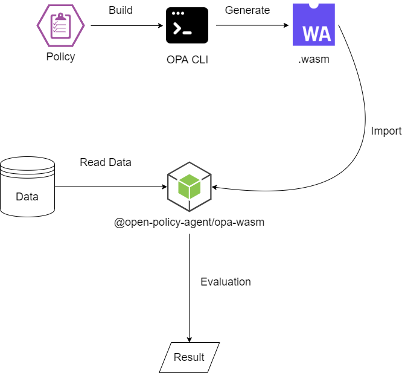

OPA WebAssembly Typescript Demo
===


This project will demo how to use OPA for authorization with webassembly on typescript.

RBAC examples reference： [https://www.openpolicyagent.org/docs/latest/comparison-to-other-systems/](https://www.openpolicyagent.org/docs/latest/comparison-to-other-systems/)

## Flow



## Install OPA binary on Linux

```sh
curl -L -o opa https://openpolicyagent.org/downloads/v0.29.4/opa_linux_amd64
mv opa /usr/local/bin
chmod 755 /usr/local/bin/opa
opa -h
```

## Install dependencies
```sh
npm install
```

## Create Ploicy
* example.rego
```rego
package example

default allow = false
allow {
	# list of roles for input user
    roles := data.user_roles[input.user]

    # for each role
    r := roles[_]

    # lookup the permissions list for role
    permissions := data.role_permissions[r]

    # for each permission
    p := permissions[_]

    # check permission
    p == {"action": input.action, "object": input.object }
}
```

* Our data will be dynamically generated, an example is as follows：
* Reference： [https://github.com/weihanchen/opa-webassembly-ts/blob/master/app.ts#L9](https://github.com/weihanchen/opa-webassembly-ts/blob/master/app.ts#L9)
```javascript
{
    // user-role assignments
    user_roles: {
      UserA: ["manager"],
    },
    // role-permissions assignments
    role_permissions: {
      manager: [{ action: "edit", object: "article" }],
    },
  }
```

## Build .wasm binary

```sh
opa build -t wasm -e 'example/allow' ./example.rego && tar -xzf ./bundle.tar.gz /policy.wasm
# or npm run build:opa
```

## Run the example code that invokes the Wasm binary
```sh
npm start -- "{\"user\":\"UserA\",\"object\":\"article\",\"action\":\"edit\"}"
```

## Result
```json
[
  {
    "result": true
  }
]
```

## Unit Test
```sh
./opa test -v policy/*.rego
```